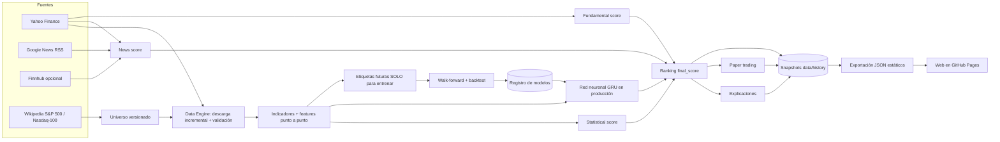

# Acciones-Bursatiles · Plataforma de análisis cuantitativo y paper trading

Plataforma automatizada que analiza acciones de EE.UU. (S&P 500 + Nasdaq-100), calcula indicadores técnicos
(con **MA(7), MA(25) y MA(99)**), analiza noticias y fundamentales, combina un **modelo estadístico** con una
**red neuronal recurrente (PyTorch)**, evalúa todo con **backtesting walk-forward sin información futura**,
mantiene un **paper trading** con historial completo y lo publica en una **web interactiva** (GitHub Pages),
todo orquestado con **GitHub Actions**.

> ⚠️ **Este proyecto es una herramienta experimental de análisis cuantitativo y paper trading. No ejecuta
> operaciones reales ni constituye asesoramiento financiero.** Todas las operaciones son simulaciones. Los scores
> son métricas internas del sistema, no certezas ni recomendaciones.

---

## Índice

1. [Qué hace](#qué-hace)
2. [Arquitectura](#arquitectura)
3. [Instalación](#instalación)
4. [Configuración](#configuración)
5. [Fuentes de datos y GitHub Secrets](#fuentes-de-datos-y-github-secrets)
6. [Ejecución local](#ejecución-local)
7. [Backtesting](#backtesting)
8. [Entrenamiento de la red neuronal](#entrenamiento-de-la-red-neuronal)
9. [GitHub Actions](#github-actions)
10. [GitHub Pages](#github-pages)
11. [Estructura de datos](#estructura-de-datos)
12. [Cómo interpretar las métricas](#cómo-interpretar-las-métricas)
13. [Prevención de data leakage](#prevención-de-data-leakage)
14. [Ausencia de operaciones reales y modos](#ausencia-de-operaciones-reales-y-modos)
15. [Limitaciones](#limitaciones)

---

## Qué hace

| Componente | Módulo | Qué hace |
|---|---|---|
| A. Data Engine | `src/data/` | Universo versionado, proveedores intercambiables (yfinance), descarga incremental con detección de cambios de ajuste, validación de calidad. |
| B. Technical Analysis | `src/indicators/` | MA7/25/99, SMA, EMA, RSI, MACD, ATR, Bollinger, momentum, ROC, volatilidad, volumen relativo, drawdown, distancias y cruces de medias, pendientes. |
| C. News & Sentiment | `src/news/`, `src/data/providers/news.py` | Yahoo Finance + Google News RSS (+ Finnhub con clave): sentimiento, relevancia, recencia, concentración, temas y explicación basada solo en titulares reales. |
| D. Statistical Scoring | `src/statistical/` | `statistical_score` 0-100 con desglose: trend, momentum, technical, volume, risk, history. |
| — Fundamentales | `src/fundamentals/` | Opcional: crecimiento, márgenes, PER, PEG, deuda/patrimonio, FCF, ROE, capitalización (ROIC no lo publica Yahoo: se marca como no disponible). |
| E. Neural Network | `src/ml/` | GRU/LSTM en PyTorch sobre secuencias de 40 sesiones × 39 variables; salidas: probabilidad de oportunidad, retorno esperado, drawdown esperado y confianza (MC dropout). |
| F. Backtesting | `src/backtesting/` | Simulación de cartera día a día, señal al cierre y ejecución en la apertura siguiente, costes, benchmarks. |
| G. Paper Trading | `src/trading/` | Operaciones simuladas PENDING → OPEN → CLOSED / INVALIDATED con las mismas reglas que el backtest; seguimiento de tus posiciones reales (`config/mis_acciones.yaml`). |
| H. Ranking | `src/ranking/` | `final_score` con los pesos de `config/model.yaml` y desglose transparente. |
| I. Explanation | `src/explanations/` | Razones con valores reales + `why_it_matters`, separando datos objetivos de la explicación del modelo. |
| J. Storage | `data/` | Snapshots diarios, ledger del paper trading, archivo de noticias, registro de modelos, resultados. |
| K. Dashboard | `frontend/` | React + TypeScript + Vite: Dashboard, Oportunidades, Seguimiento, Historial, Acciones, Backtesting, Modelo IA y Noticias. |
| L. GitHub Actions | `.github/workflows/` | Actualización diaria, entrenamiento semanal, despliegue y tests. |
| M. Tests | `tests/` | 60 pruebas, incluidas las de fugas de información (`test_no_leakage.py`). |

---

## Arquitectura



Flujo diario (`scripts/generate_signals.py` → `src/pipeline/update.py`):

1. Calendario NYSE en `America/New_York`: si no hay sesión nueva cerrada, no hace nada.
2. Universo → descarga incremental → validación (duplicados, faltantes, precios/volúmenes inválidos, OHLC incoherente,
   picos de un día, cambios extremos, huecos, datos desactualizados).
3. Indicadores, features, etiquetas históricas y scores estadísticos de todas las acciones válidas y líquidas.
4. Inferencia del modelo en producción (si existe y es compatible con la versión de features).
5. Preselección (`preliminary_candidates`) → noticias y fundamentales de esas candidatas.
6. Ranking final, oportunidades y explicaciones.
7. Paper trading: ejecuta entradas pendientes, revisa salidas y crea nuevas señales.
8. Snapshot del día, archivo de noticias, informe de calidad y resumen de la ejecución.

Estructura del proyecto:

```
config/                universe.yaml · data.yaml · model.yaml · strategy.yaml · mis_acciones.yaml · universe_fallback.csv
src/
  config.py            carga de YAML y rutas          market_calendar.py   calendario NYSE
  logging_utils.py     logs [DATA] [NEWS] [MODEL]... y resumen final
  data/                providers/ (base, market_data, news, fundamentals) · universe · validation · market · storage
  indicators/          technical.py
  features/            builder.py (features) · labels.py (etiquetas futuras, solo entrenamiento)
  statistical/  news/  fundamentals/  ranking/  explanations/
  ml/                  dataset · model · train · walkforward · registry · inference · metrics · numpy_mlp
  backtesting/         engine · strategies · metrics · runner
  trading/             paper (simulación) · manual (tus posiciones) · broker (sin ejecución real)
  pipeline/            analysis · update · train · backtest · export · history
scripts/               update_market · update_news · build_dataset · train_model · run_backtest · generate_signals · export_frontend
tests/                 test_data · test_indicators · test_features · test_backtest · test_model · test_no_leakage · test_trading · ...
frontend/              React + TypeScript + Vite (lightweight-charts + Recharts)
data/                  estado versionado (ver «Estructura de datos»)
```

---

## Instalación

Requisitos: Python 3.11+ y Node 20.19+ (o 22).

```bash
pip install -r requirements-dev.txt     # incluye PyTorch para CPU y pytest
cd frontend && npm ci && cd ..
```

`requirements.txt` no incluye PyTorch (lo usa el despliegue, que no necesita la red); `requirements-ml.txt` instala
PyTorch desde el índice de CPU para no descargar las librerías CUDA.

---

## Configuración

Todo lo importante está en `config/` (no hay reglas fijas en el código):

- **`universe.yaml`**: `sp500`, `nasdaq100`, `additional_symbols`, `exclude_symbols`, `max_symbols`, índices de
  referencia y filtros de liquidez/calidad (`min_price`, `min_avg_dollar_volume`, `min_history_days`, `max_stale_days`).
- **`data.yaml`**: proveedor de mercado, inicio del historial, reintentos y timeouts, calendario y zona horaria,
  umbrales de validación, proveedores de noticias, fundamentales y tamaño de la exportación web.
- **`model.yaml`**: versión de features, longitud de secuencia, definición de la etiqueta, pesos del score
  estadístico, **pesos del ranking**, hiperparámetros de la red, configuración walk-forward y criterios de promoción.
- **`strategy.yaml`**: modo (`RESEARCH` / `PAPER_TRADING`), umbrales de entrada (`min_final_score`,
  `min_statistical_score`, `min_neural_probability`), `max_positions`, `holding_period_days`, `stop_loss`,
  `take_profit`, gap máximo, costes, umbral de oportunidad y estrategias del backtest.
- **`mis_acciones.yaml`**: tus compras reales para seguirlas en la página Seguimiento (con tus razones o, si las dejas
  vacías, las del análisis automático).

Ejemplo de cambio de pesos (solo en `config/model.yaml`):

```yaml
ranking:
  weights: {statistical: 0.35, news: 0.15, fundamental: 0.15, neural: 0.25, risk: 0.10}
```

Si un componente falta (sin noticias, sin fundamentales o sin modelo en producción), su peso se reparte entre los
demás y la web muestra el desglose usado.

---

## Fuentes de datos y GitHub Secrets

| Fuente | Uso | Clave |
|---|---|---|
| Yahoo Finance (`yfinance`) | Precios OHLC, cierre ajustado, volumen, dividendos, splits; noticias; fundamentales | No |
| Google News RSS | Noticias | No |
| Wikipedia | Componentes del S&P 500 y Nasdaq-100 | No |
| Finnhub (opcional) | Noticias adicionales | `NEWS_API_KEY` |

- Configura el secreto en **Settings → Secrets and variables → Actions → New repository secret → `NEWS_API_KEY`**
  (clave gratuita de finnhub.io). Sin él, esa fuente simplemente no se usa.
- Las claves nunca se escriben en archivos ni en logs. `MARKET_DATA_API_KEY` no se usa: el proveedor de mercado actual
  no la necesita. Para añadir otro proveedor (Polygon, Alpha Vantage...) implementa `MarketDataProvider` en
  `src/data/providers/` y regístralo en `src/data/providers/__init__.py`.
- Si una fuente falla (caída, límite de peticiones, sin resultados) el pipeline sigue con las demás; si falla la
  descarga de un símbolo se usa su caché marcada como desactualizada; un símbolo problemático nunca detiene el resto.

---

## Ejecución local

```bash
# Pipeline diario completo (datos reales; necesita internet)
python scripts/generate_signals.py                 # --force para reprocesar la sesión, --max-symbols 50 para probar
python scripts/export_frontend.py                  # genera frontend/public/data
cd frontend && npm run dev                         # http://localhost:5173

# Etapas sueltas
python scripts/update_market.py                    # solo descarga y validación
python scripts/update_news.py                      # noticias de oportunidades y seguimiento
python scripts/build_dataset.py                    # dataset de entrenamiento (data/processed)

# Desarrollo sin conexión: datos SINTÉTICOS en otra carpeta (la web lo indica con un aviso rojo)
python scripts/generate_signals.py --offline --data-dir /tmp/demo --max-symbols 40
python scripts/train_model.py --offline --data-dir /tmp/demo --max-symbols 40 --skip-data-update --quick
python scripts/export_frontend.py --offline --data-dir /tmp/demo --max-symbols 40

python -m pytest -q                                # tests
```

> `--offline` existe solo para desarrollar y probar sin red. Los workflows nunca lo usan y los datos sintéticos nunca
> deben guardarse en `data/`.

---

## Backtesting

```bash
python scripts/train_model.py        # entrena (walk-forward) y ejecuta el backtest completo
python scripts/run_backtest.py       # repite solo el backtest con las últimas predicciones fuera de muestra
```

- Señal con datos hasta el cierre de T; **entrada en la apertura de T+1**; salida por stop-loss, take-profit,
  ruptura de tendencia (MA7 < MA25 y cierre < MA99, a la apertura siguiente) o al cumplir `holding_period_days`.
  Si stop y objetivo se tocan el mismo día se asume el stop (conservador); los gaps se ejecutan a la apertura.
- Comisión + deslizamiento en cada entrada y salida; tamaño equiponderado (1/`max_positions` del valor de la cartera).
- La probabilidad de la red en el backtest procede de la **validación walk-forward**: cada año se predice con un modelo
  entrenado solo con años anteriores (con purga). El score estadístico no se ajusta a los datos (reglas fijas).
- Se comparan: sistema combinado, solo estadístico, solo red neuronal, cruce MA(7)/MA(25), **Buy & Hold SPY** y cartera
  equiponderada del universo. Métricas: retorno total, CAGR, win rate, ganancia/pérdida media, profit factor, drawdown
  máximo, Sharpe, Sortino, nº de operaciones, días medios, exposición, volatilidad y resultados por año.

---

## Entrenamiento de la red neuronal

- **Qué aprende:** P(oportunidad | datos disponibles hasta T). La etiqueta simula la operación de la estrategia (entrada
  en la apertura de T+1, stop/take-profit/plazo, costes) y es 1 si el retorno neto supera `labels.min_trade_return`.
  El futuro solo se usa para construir esa etiqueta, nunca como entrada.
- **Entradas:** 39 variables relativas por sesión (OHLCV normalizado, retornos, distancias y pendientes de MA7/25/99,
  cruces, RSI, MACD, Bollinger, ATR, volatilidad, volumen relativo, drawdown, contexto del S&P 500) en secuencias de 40.
  Las features de noticias están implementadas punto a punto pero desactivadas hasta que el archivo propio tenga
  historia suficiente (`features.use_news_features`).
- **Arquitectura:** GRU (o LSTM) → LayerNorm → dropout → 3 cabezas (probabilidad, retorno esperado, drawdown esperado).
  AdamW con weight decay, recorte de gradiente, parada temprana, semillas fijas. Confianza = estabilidad de la
  probabilidad con 10 pasadas de MC dropout.
- **Validación:** walk-forward anual con purga (≥ horizonte + 1 sesiones) entre entrenamiento, validación y test; la
  normalización se ajusta solo con filas de entrenamiento.
- **Benchmarks:** score estadístico, momentum de 3 meses, regresión logística (features del último día) y azar.
- **Promoción** (`model.yaml → promotion`): un candidato solo pasa a producción si supera AUC mínima, lift mínimo del
  decil superior, **no queda por debajo de los benchmarks sencillos** y no empeora claramente al modelo en producción
  (AUC y Sharpe del backtest). Si no, queda registrado como `rejected` con los motivos y el anterior sigue en producción.
- **Versionado:** `model_v001`, `model_v002`... con fecha, periodo de entrenamiento, versión de features, definición de
  la etiqueta, hiperparámetros, métricas por fold, benchmarks, backtest, importancia de variables y huella del dataset.
- **Explicabilidad:** importancia por permutación (global) y sensibilidad por oclusión (por acción), siempre marcadas
  como «explicación del modelo», distinta de las afirmaciones objetivas sobre la empresa.
- **Fase futura:** la arquitectura (salidas de retorno/drawdown y simulador compartido) permite añadir aprendizaje por
  refuerzo más adelante; no se incluye para priorizar estabilidad y validación correcta.

---

## GitHub Actions

| Workflow | Cuándo | Qué hace |
|---|---|---|
| `market_update.yml` | Lunes a viernes 22:15 UTC (18:15 Nueva York en verano, 17:15 en invierno) y manual | Tests críticos → pipeline diario → valida la exportación → commit de `data/` → despliega la web |
| `model_training.yml` | Sábados 12:40 UTC y manual (`train_and_backtest` / `backtest_only`) | Tests → actualización de datos → walk-forward → candidato → backtest → promoción → commit → despliegue |
| `deploy.yml` | Tras los anteriores, al cambiar el frontend y manual | Exporta JSON desde el estado versionado + caché de precios → `npm run build` → GitHub Pages |
| `tests.yml` | Push a `main` y pull requests | Pytest completo + compilación del frontend |

- **Zona horaria:** el cron de GitHub es UTC; la hora elegida cae siempre después del cierre (16:00 ET) con y sin horario
  de verano, y `src/market_calendar.py` (NYSE, `America/New_York`, festivos incluidos) decide si hay sesión nueva.
  Los días festivos o ya procesados terminan con `status=skipped` sin commit ni despliegue.
- **Caché:** los precios (`data/raw`) se guardan con `actions/cache`; las predicciones fuera de muestra (`data/processed`)
  también. Las dependencias de pip y npm se cachean.
- **Seguridad del historial:** los workflows que escriben datos comparten el grupo de concurrencia `data-pipeline`; si un
  test crítico o una etapa falla, no se hace commit ni se publica. La exportación se valida (JSON sin NaN) antes del commit.
- **Requisito:** los workflows programados solo se ejecutan desde la rama por defecto (`main`).

---

## GitHub Pages

1. Lleva el código a `main`.
2. **Settings → Pages → Build and deployment → Source: GitHub Actions**.
3. Si el push de datos falla con 403: **Settings → Actions → General → Workflow permissions → Read and write**.
4. Ejecuta **Actions → Market update → Run workflow** (la primera vez descarga el historial desde 2010: ~10-20 min).
5. Ejecuta **Actions → Model training → Run workflow** para el primer modelo y el backtest (puede tardar 1-3 h).
6. La web queda en `https://<usuario>.github.io/<repositorio>/`. Las rutas usan `#` (por ejemplo
   `.../#/stock/AAPL`, `.../#/tracking`, `.../#/history`) para funcionar en Pages sin configuración del servidor.

---

## Estructura de datos

```
data/
  raw/                       precios por acción (timestamp, open, high, low, close, adj_close, volume, dividends, splits)
                             csv.gz — caché de Actions, NO versionado
  processed/                 dataset y predicciones fuera de muestra — caché, NO versionado
  universe/universe.csv      universo versionado (símbolo, nombre, sector, industria, índices)
  history/AAAA-MM-DD/        snapshot diario: snapshot.json (metadatos, modelo, oportunidades, eventos),
                             scores.csv.gz (todas las acciones), details.json.gz (noticias, fundamentales, red, explicación)
  state/                     trades.json (ledger del paper trading), equity.json, latest.json
  news/AAAA-MM.jsonl.gz      archivo de noticias únicas con sentimiento
  models/registry.json       versiones (producción, rechazadas, archivadas) y métricas; model_vNNN/ con los pesos promovidos
  results/                   backtest_latest.json, backtest_trades.csv.gz, backtests/<versión>.json,
                             training_latest.json, data_quality.json, last_run_summary.json
frontend/public/data/        generado en cada despliegue: market.json, opportunities.json, tracking.json, history.json,
                             backtest.json, model.json, news.json, stocks/index.json, stocks/<SÍMBOLO>.json
```

Con los snapshots se puede reconstruir qué pensaba el sistema cada día y qué pasó después (página Historial y
«Evaluación en vivo» en Modelo IA). Cada JSON lleva `generated_at` y `data_as_of`.

Campos de cada operación simulada: `trade_id, symbol, signal_date, entry_date, entry_price, exit_date, exit_price,
status, reason, reasons, why_it_matters, statistical_score, news_score, fundamental_score, neural_score, final_score,
confidence, expected_return, actual_return, max_drawdown, holding_days, model_version...`

---

## Cómo interpretar las métricas

- **Scores (0-100):** métricas internas para ordenar. 50 ≈ neutro. No son probabilidades ni recomendaciones.
- **Probabilidad de oportunidad:** salida de la red, comparable con la **tasa base** (proporción histórica de
  oportunidades). Importa más el *lift* (probabilidad / tasa base) que el valor absoluto.
- **ROC-AUC:** 0,5 = azar; 0,55-0,60 ya es una señal modesta pero útil en mercados. **Precision/Recall/F1** dependen del
  umbral. **Lift del decil superior:** cuántas veces más oportunidades hay en el 10 % mejor valorado que en la media.
- **Sharpe / Sortino:** rentabilidad por unidad de volatilidad total / bajista (anualizados, tipo libre de riesgo en
  `strategy.yaml`). **Max drawdown:** peor caída desde un máximo. **Profit factor:** ganancias / pérdidas.
  **Exposición:** fracción media del capital invertida.
- Las métricas que necesitan más historial (p. ej. Sharpe con < 20 días) se muestran como «n/d» en lugar de inventarse.

---

## Prevención de data leakage

| Riesgo | Cómo se evita | Prueba |
|---|---|---|
| Usar precios futuros en features | Indicadores causales (ventanas hacia atrás, EWM sin centrar) | Alterar o recortar el futuro no cambia indicadores, features ni scores (`test_no_leakage.py`) |
| Máxima subida futura como feature | Solo existe en `src/features/labels.py`; ninguna columna de etiqueta es feature | `test_labels_are_the_only_forward_looking_data` |
| Normalizar con todo el dataset | Media/desviación solo de filas de entrenamiento | `test_scaler_fitted_only_on_training_rows` |
| Solapamiento de etiquetas entre periodos | Purga ≥ horizonte + 1 sesiones entre train/validación/test | `test_walk_forward_folds_are_separated_and_purged` |
| Noticias posteriores a la decisión | Se descartan las publicadas después del cierre de T | `test_news_published_after_decision_are_ignored`, `test_news_features_respect_decision_cutoff` |
| Comportamiento histórico con resultados aún no conocidos | Etiquetas desplazadas H sesiones | `test_statistical_scores_do_not_use_future` |
| Ejecutar en el mismo cierre de la señal | Entrada en la apertura de T+1 | `test_engine_matches_label_simulation` |
| Liquidez con datos futuros | Filtro de volumen/precio punto a punto | `test_liquidity_filter_is_point_in_time` |
| Ajustes por dividendos/splits | Features relativas e invariantes a escala | `test_features_are_scale_invariant` |

Las pruebas de fuga se verificaron introduciendo fugas a propósito (media móvil centrada, comportamiento histórico sin
desplazar): los tests fallan como deben.

---

## Ausencia de operaciones reales y modos

- `strategy.yaml → mode: PAPER_TRADING` abre y cierra operaciones **simuladas**; `RESEARCH` solo genera señales,
  ranking e historial.
- `src/trading/broker.py` define una interfaz de broker para el futuro, pero el único broker incluido es el simulado y
  cualquier modo distinto lanza `RealExecutionDisabled`. No hay credenciales de brokers ni envío de órdenes.

---

## Limitaciones

- **Sesgo de supervivencia:** el universo es la composición actual de los índices; las empresas que salieron no están
  en el backtest, lo que tiende a mejorar los resultados históricos.
- Noticias y fundamentales gratuitos no tienen historial punto a punto: no intervienen en el backtest ni en el
  entrenamiento (sí en el ranking diario).
- Fuentes gratuitas: pueden fallar, cambiar de formato, limitar peticiones o revisar datos; el sistema degrada con
  cachés y respaldos, pero los datos pueden contener errores.
- El sentimiento es léxico (VADER + vocabulario financiero): no entiende ironía ni contexto complejo.
- Los precios de los gráficos y del backtest están ajustados por dividendos y splits; el paper trading usa precios
  negociados y aplica los splits a la posición.
- Rendimientos pasados o simulados no garantizan resultados futuros.
